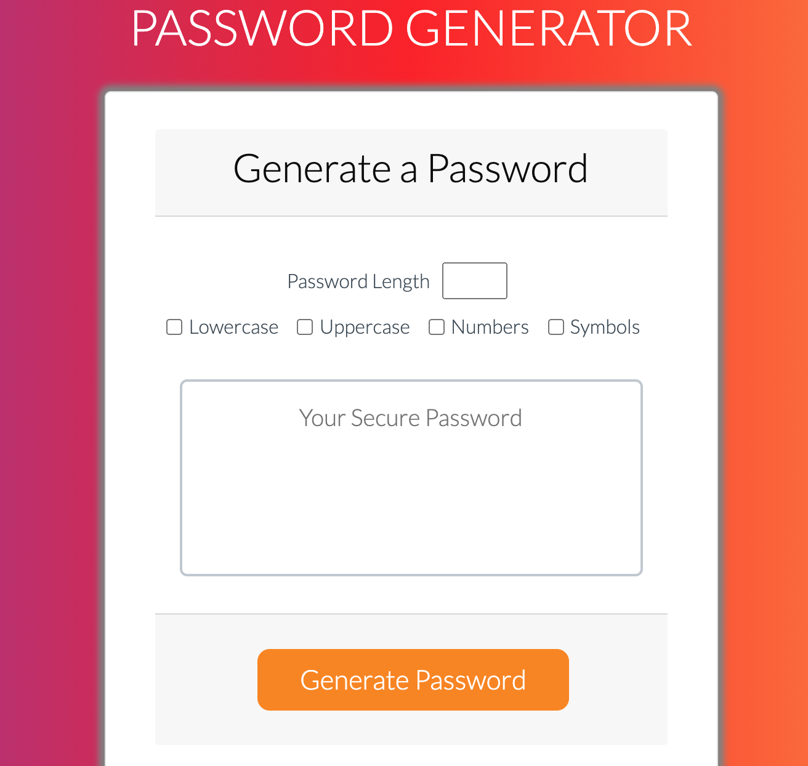

# Password Generator

Link to live website: (https://abalcs.github.io/Password-Generator/)

## Instructions
To create a password generator that takes user inputs to create a randomized string of characters.

## Purpose
Having strong and secure passwords is important for everyone in order to keep their data and privacy safe.

## Directions
The password must be 8-128 characters long.

Also, the user must choose at least one of the following:

Special Characters
Numeric Characters
Lowercase Characters
Uppercase Characters

Once generated, the user can click on the clipboard icon to copy the password to their clipboard.